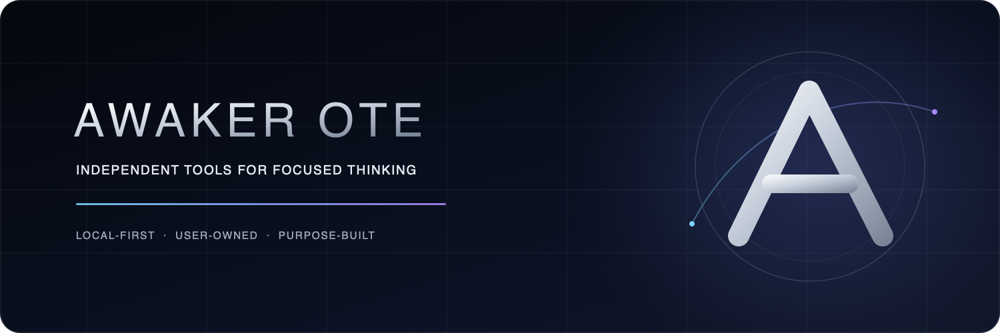

  

  Building local-first software for capturing ideas, reading deeply, and working with AI. 
  为记录、阅读与 AI 协作构建本地优先的开源工具。

  <a href="https://github.com/Awaker-OTE/WakeGPT">WakeGPT</a>
  &nbsp;·&nbsp;
  <a href="https://github.com/Awaker-OTE/readingspace-mn">ReadingSpace MN</a>
  &nbsp;·&nbsp;
  <a href="https://github.com/Awaker-OTE/WakeGPT/releases">Releases</a>

---

## Featured projects

<table>
  <tr>
    <td width="50%" valign="top">
      <h3><a href="https://github.com/Awaker-OTE/WakeGPT">WakeGPT</a></h3>
      
A local-first desktop app for quick capture, managed Markdown notebooks, and reusable ChatGPT/Codex context.

      
Rust · Tauri · macOS

      

        <a href="https://github.com/Awaker-OTE/WakeGPT"><strong>View project →</strong></a>
        ·
        <a href="https://github.com/Awaker-OTE/WakeGPT/releases/tag/v0.1.0">macOS preview</a>
      

    </td>
    <td width="50%" valign="top">
      <h3><a href="https://github.com/Awaker-OTE/readingspace-mn">ReadingSpace MN</a></h3>
      
A reading workflow plugin for MarginNote 4.

      
JavaScript · MarginNote 4

      

        <a href="https://github.com/Awaker-OTE/readingspace-mn"><strong>View project →</strong></a>
      

    </td>
  </tr>
</table>

## What guides the work

- **Local-first** — keep important work close to the user.
- **User-owned data** — make information portable and understandable.
- **Open development** — document decisions, limitations, and ways to contribute.

## Current focus

- Building and validating WakeGPT for macOS.
- Improving the ReadingSpace MN workflow for MarginNote 4.
- Preparing clear documentation and contribution paths for public collaboration.

## Connect

Project questions, bug reports, and contributions are welcome through the issue tracker of each repository.
